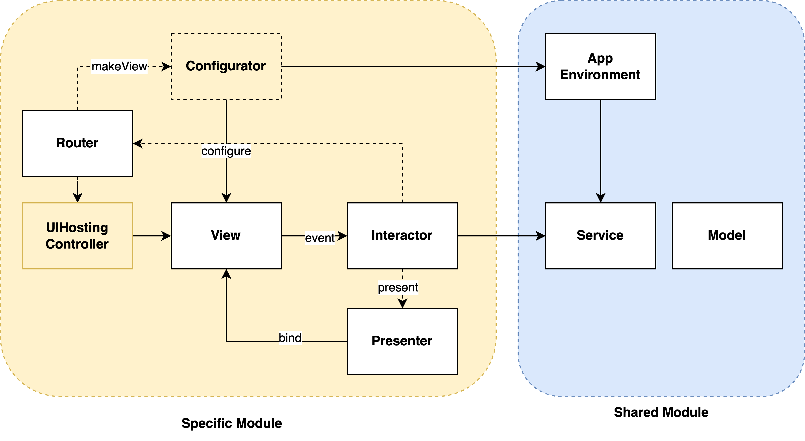

# VIP-DashboardDemo

A Sample implementation of configurable Dashboard with use of VIP architecture

## Guide

### Interactor
- Stateless
- All dependencies are private
- Constructor requires all dependencies 
- Data also passed via constructor

### Presenter
- Statefull
- All properties @Published
- Contructor with default value
